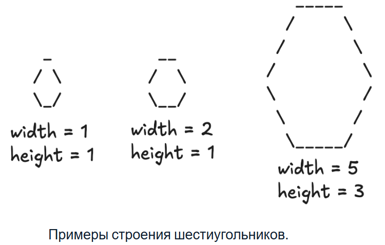

# Шестиугольник

[Вернуться в главное меню](../../../README.md)

## Требования

## Баллы

Максимально - 9.

## Условие задачи

Изобразите шестиугольник заданного размера, используя символы «_» — нижнее подчёркивание, «/» — прямой слеш, «\» — обратный слеш. Размер шестиугольника определяется двумя параметрами:

- $width$ — количество символов «_» на верхней и нижней сторонах шестиугольника;
- $height$ — количество прямых «/» или обратных «\» слешей на каждой из четырёх боковых сторон шестиугольника.

## Входные данные

В первой строке дано натуральное число $t$ (1≤$t$≤500) — количество шестиугольников, которые нужно изобразить.

В каждой из следующих t строк дано по два натуральных числа через пробел $widthi$, $heighti$ (1≤$widthi$, $heighti$≤50) — требуемая ширина и высота $i$-го шестиугольника.

Гарантируется, что в рамках генерации понадобится вывести не более 3000 символов.

## Выходные данные

Выведите в ответе 
t
t
 шестиугольников, руководствуясь примерами, где 
i
−
й
i−й
 шестиугольник имеет размер 
w
i
d
t
h
i
width 
i
​
 
 и 
h
e
i
g
h
t
i
height 
i
​
 
.

Используйте нужное количество пробелов:
• Между символами 
«/»
«/»
 и 
«\»
«\»
. Для нижней стороны шестиугольника вместо пробелов используйте 
«_»
«_»
 в количестве 
w
i
d
t
h
i
width 
i
​
 
.
• От начала каждой строки до первого символа 
«/»
«/»
, 
«\»
«\»
 или 
«_»
«_»
. Для самой длинной строки в шестиугольнике пробелы в начале не нужны.

После последнего символа 
«_»
«_»
, 
«/»
«/»
 или 
«\»
«\»
 в каждой строке используйте перенос строки без дополнительных пробелов.

Шестиугольники должны идти один за другим через один перенос строки. Между шестиугольниками не должно быть пустых строк. 

Вывод должен оканчиваться одним переносом строки.

## Пример теста 1

### Входные данные теста 1

3
1 1
2 1
5 3

### Выходные данные теста 1

 _
/ \
\_/
 __
/  \
\__/
   _____
  /     \
 /       \
/         \
\         /
 \       /
  \_____/

